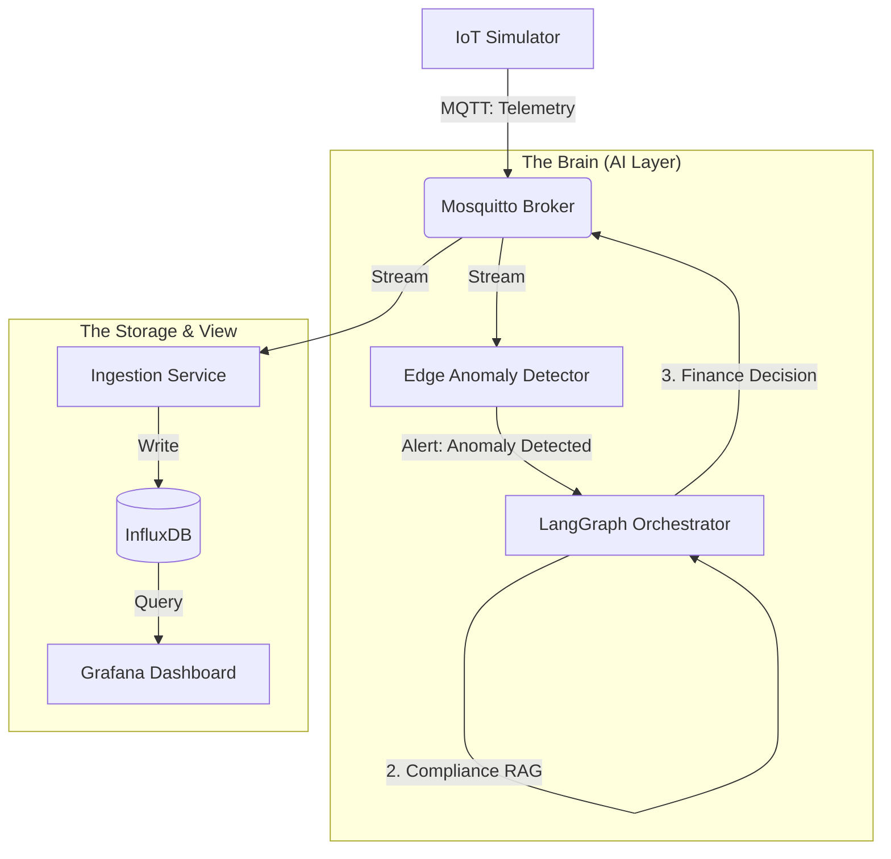

# 🚛 SmartTradeX: Autonomous AI Supply Chain Enforcer

> **A Self-Healing Logistics Platform that uses Edge AI to detect failures and Autonomous Agents (LangGraph) to enforce contracts in real-time.**


---

## 📸 System Overview


*Above: The system detects a refrigeration failure (Red Graph), triggers an AI Alert (Anomaly Score), and the Agent autonomously blocks the payment (Status: BLOCKED).*

---

## 🧠 The Problem
Traditional supply chains are **reactive**. If a container of vaccines overheats, the data is logged, but the financial loss happens anyway.

**SmartTradeX** changes this to an **active** system. It doesn't just log errors; it physically intervenes in the financial transaction logic to prevent loss using Autonomous AI Agents.

---

## 🏗️ Architecture

The system follows a distributed microservices architecture containerized with Docker.


---

## 🔧 Key Components

| Service | Tech Stack | Responsibility |
| :--- | :--- | :--- |
| **IoT Simulator** | Python, Faker | Generates realistic telemetry (GPS, Shock, Temp) & simulates failures. |
| **Edge Sentinel** | Scikit-Learn | Runs an Isolation Forest model to detect statistical anomalies in real-time. |
| **Orchestrator** | LangGraph | A Multi-Agent Supervisor that validates compliance and governs payments. |
| **Ingestion** | Python, InfluxDB | Universal listener that normalizes data for high-throughput storage. |
| **Dashboard** | Grafana, Flux | Real-time visualization of sensor data, AI scores, and Agent decisions. |

---

## 🚀 How It Works (The "Agentic" Workflow)

1.  **Sensing:** The Simulator streams data. Occasionally, it simulates a "Cooler Failure" (Temp > 10°C).
2.  **Detection:** The Edge Sentinel sees the deviation from the normal distribution and flags an anomaly (Score < -0.02).
3.  **Orchestration:** The LangGraph Supervisor wakes up:
    * **Logistics Agent:** Confirms the sensor reading is valid (not a glitch).
    * **Compliance Agent:** Checks the digital contract: "Clause 4.1: If Temp > 8°C, breach."
    * **Finance Agent:** Executes the final command: "HOLD_PAYMENT".
4.  **Result:** The decision is published back to the system and visualized instantly on Grafana.

---

## 🛠️ Installation & Setup

**Prerequisites:** Docker & Docker Compose.

```bash
# 1. Clone the repo
git clone [https://github.com/Stuti-1908/SmartTradeX-Autonomous-Supply-Chain.git](https://github.com/Stuti-1908/SmartTradeX-Autonomous-Supply-Chain.git)
cd SmartTradeX-Autonomous-Supply-Chain

# 2. Start the stack (This builds 6 microservices)
docker-compose up --build


